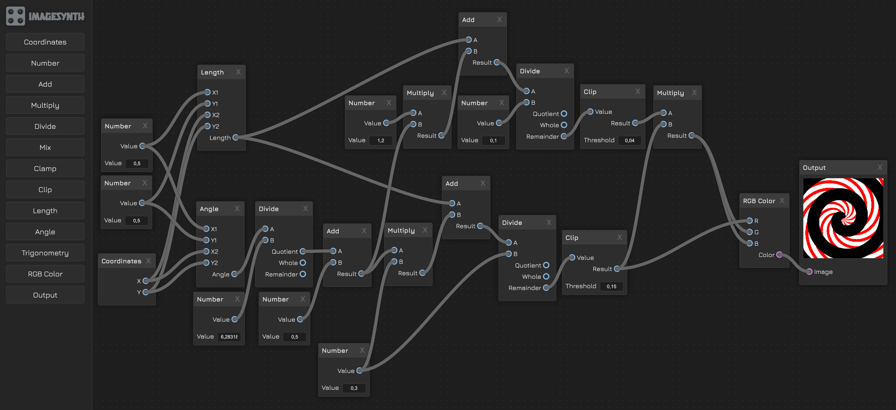

# ImageSynth

Modular syntesis-based image generator.

Add and connect simple modules to build complex images.

Mostly vibe coded using Claude Sonnet 3.5.

[Live Demo](https://zordone.github.io/image-synth/)



## Features

- Image generation
- Synthesis algorithms
- Real-time manipulation
- Local storage persistence

## Installation

```bash
yarn install --immutable
```

## Usage

```bash
yarn start
```
